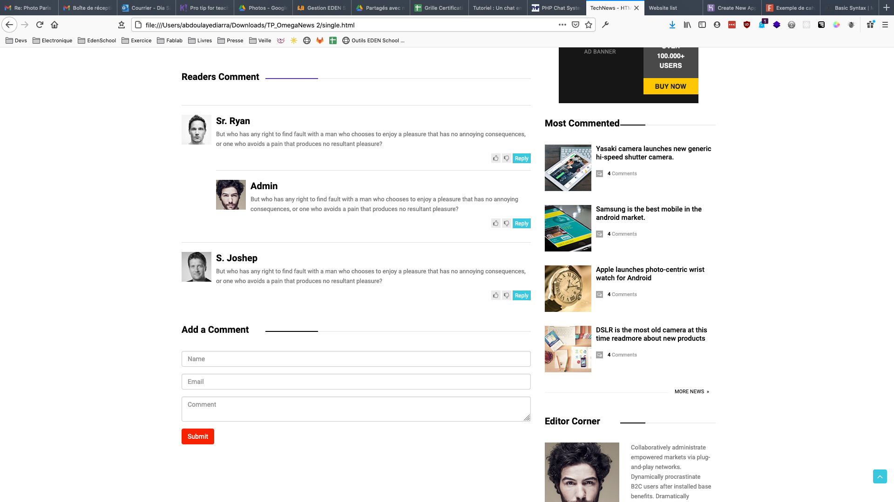
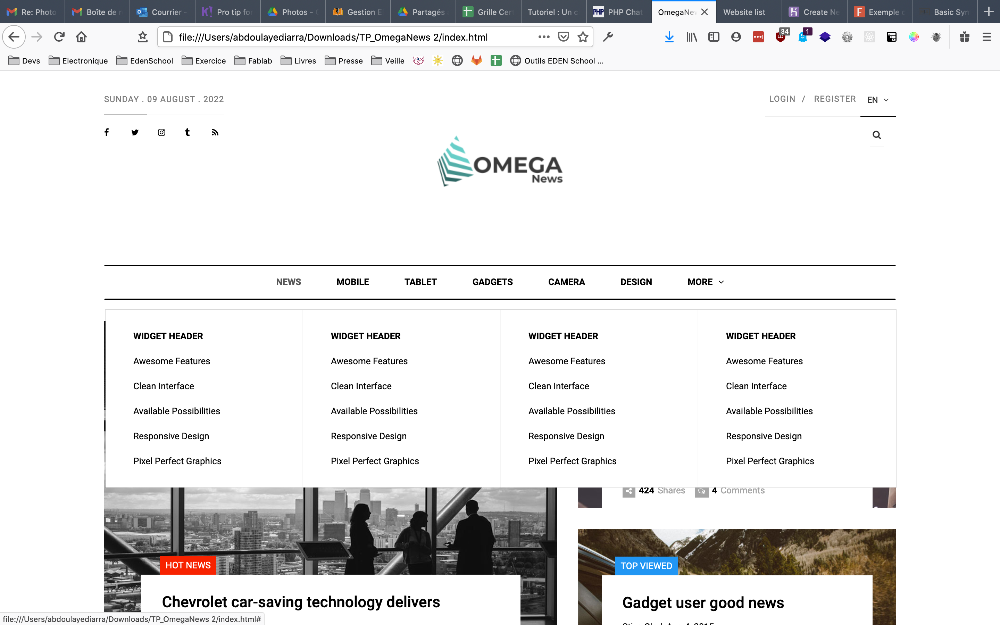

# TP Évaluation

Cette évaluation a pour but d'évaluer votre capacité à concevoir, modéliser et réaliser un projet web à partir d'un cahier des charges.

### L'entreprise
*EDEN News* une entreprise de presse souhaitant mettre en place une version numérique de son journal. Après recherche, félicitation tu as décroché le contrat, c'est donc à toi de mener le projet à bien !!!

### L'objectif du site
Ton objectif est de réaliser une version numérique du média plus attractive que la version papier. Le site doit être fluide, intuitif et fonctionnel.

### Les cibles
*EDEN News* est journal pour adolescent, jeunes adultes, adultes, hommes, femmes, animaux de compagnies, dev.

### Périmètre du projet
Le site d'*EDEN News* est exclusivement en français, il est également adapté pour les **supports mobiles**.

###  Charte graphique
Les couleurs du site seront principalement le **noir**, le **blanc** et le **gris**. Les titres et liens auront pour police ***Roboto*** quant au texte il utilise la police ***Alegreya Sans***.
Le journal impose l'utilisation de la librairie ***Fontawesome*** pour les icônes du site, ainsi que *"Bootstrap 3.4"* pour la mise en page. Pour les carousels aucunes autres bibliothèques qu’***OwlCarousel*** ne sera accepté.

<ins>Couleurs:</ins>

***NOIR*** : *#3A3A3A;*

***BLANC*** : *#FFFFFF;*

***GRIS*** : *#A5A5A5;*

***CATÉGORIE 1*** : *#5F35AC;*

***CATÉGORIE 2*** : *#F72300;*

***CATÉGORIE 3*** : *#2196F3;*

***CATÉGORIE 4*** : *#FF8400;*

***CATÉGORIE 5*** : *#000000;*

Si vous disposez de plus de 5 catégories vous êtes libre de choisir les couleurs(ex : catégorie 6, 7, etc.).

<ins>Voici les maquettes des différentes vues :</ins>
 1. **Page accueil**
  
   
 2. **Vue Catégorie**
   
    
 3. **Vue Blog**
   
    
 4. **Vue Article/Blog** (show)
   
    
 5. **Commentaires**
   
    
 6. **Menu**
   
    
 7. **Connexion/Inscription**
  Vous avez une totale liberté sur le style de ces pages, veillez à bien respecter la charte graphique.
  
   
### Arborescence
L'arborescence du site sse compose de 5 liens principaux, *News* il s'agit de la page de blog elle affiche les 5 derniers articles de chaque catégories(parent). *Catégories* est un lien déroulant qui ouvre un panel avec chaque catégorie et sous-catégorie du site. *Auteurs* liste tous les auteurs d'articles présents sur le site. *Galerie* affiche une galerie d'images plus précisément les images des articles du site. *Contact* affiche un formulaire permettant de contacter via email le webmaster(Vous en l'occurrence).

### Description fonctionnelle
*EDEN News* souhaite intégrer les fonctionnalités suivantes :
 - **Authentification**
   Tous visiteurs du site a la possibilité de s'authentifier ou de s'inscrire le cas échéant. Il existe 4 différents types de comptes
    - **Admin** : Dispose d'un contrôle total sur le site.
    - **Author** : Dispose d'une autorisation pour créer, modifier, supprimer des articles, commentaires.
    - **User** : Dispose d'une autorisation pour créer, modifier, supprimer des commentaires.
    - **Anonymous** : Dispose d'une autorisation de lecture sur le site.

 
- **Administration du site**
  La connexion par le profil administrateur permet d'accéder à une interface de gestion des contenus et d'administration du site (Bootstrap admin).

 - **Gestion des catégories**
   Les différentes catégories du site seront administrable uniquement par l'administrateur du site, il pourra créer, mettre à jour, supprimer des catégories. Les utilisateurs ne peuvent en aucun cas créé, modifier ou supprimer une catégorie. Les catégories permettent de filtrer les articles. Il est possible dee créé une sous-catégorie à chaque catégorie(optionnel).

 
 - **Gestion des articles**
   Les différents articles du site seront administrable aussi bien par l'administrateur du site, que par les utilisateurs, ils pourront créer, mettre à jour, supprimer des articles. Tout article publier sera visible par tous les visiteurs du site. Pour ce qui est de l'administration des articles l'administrateur du site a la possibilité de supprimer n'importe quel articles, mais ne peut modifier uniquement ceux qu'il a rédigé. Inversement un utilisateur peut modifier ou supprimer uniquement les articles qu'il a créés.

  
 - **Gestion des commentaires**
  Les visiteurs connecté on la possibilité de laisser un commentaire sur un article. Ils peuvent modifier ou supprimer leurs commentaires.

   
 - **Bloc "Articles populaires (Popular News)"**
  Ce bloc est présent sur toutes les pages hormis la page contact, il est composé des 5 derniers articles Quelles que soient leurs catégorie.

   
 - **Auteurs**
  Cette pages liste l'ensemble des auteurs d'article du site, il s'agit d'une grille avec pour chaque auteur son image de profil, nom, prénom, date d'inscription. au clique le visiteur sera redirigé vers la vue du profil où il pourra consulter le profil complet de l'auteur

### Informations relatives aux contenus
L'authentification ce fait via un formulaire de connexion composé d'un champs pour l'adresse mail et d'un champ pour le mot de passe. Pour ce qui est de l'inscription elle ce fait via un formulaire de connexion composé de champs pour le nom, prénom, image de profil, adresse mail, mot de passe et confirmation du mot de passe, bio (texte), nom du journal(si journaliste), centres d'intérêts.

Toute fois le visiteur ne peut s'inscrire avec un mail déjà présent en base.

Quant au mot de passe il doit se composer d'au moins 8 caractères et contenir une majuscule et un chiffre, il sera crypté avec l'algorithme Argon2id.
Après connexion ou inscription le visiteur sera redirigé vers son espace personnel.

Les articles sont tous sur le même format il se compose d'un titre, d'un slug, d'une description, d'un corps, d'une catégorie, d'un auteur, d'un statut, d'une date de parution, d'une date de mise à jour. Un article peut avoir plusieurs catégories mais il n'a qu'un seul auteur. Le slug, la description et la date sont généré dynamiquement à la création de l'article. Chaque article a un auteur, des catégories et des commentaires qui lui sont propres.

Chaque catégorie d'article dispose de sa vue dans laquelle seront affiché tous les articles de la dite catégorie et de ces enfants (sous-catégorie). Une catégorie se compose de son nom et d'une courte description n'excédant pas 255 caractères et d'une sous-catégorie(optionnel).

Les commentaires se compose du nom et de la photo de profil de l'auteur, de la date de publication et du corps du commentaire.

La date et la barre de recherche sont gérées dynamiquement javascript. Ainsi que le retour en haut de page (Attention celui-ci n'apparait qu'après une certaine)

### Contraintes techniques
Pour la réalisation du projet *EDEN News* souhaite un language que ces équipes maîtrise déjà, en l'occurrence le PHP et plus particulièrement la déclinaison orientée objet.

Le site devra être associé avec un répertoire github, dans lequel seront présent 3 branches principales :
 - main/master : Le code tester & valider.
 - dev : Le code en cours de développement.
 - test : Les tests des différentes fonctionnalités.

Le workflow au niveau du versioning est simple pour chaque fonctionnalité créée la branche *dev* qui va avec (ex : dev_auth, dev_category, etc.) et commité les changements dessus. Une fois la fonctionnalité testée la fusionné avec la branche principale (main/master).
Attention tout changement sur la branche principale doit avoir été au préalable déployer sur la branche dev. Aucune erreur ne sera toléré sur cette branche.

*EDEN News* doit avoir accès au répertoire github.

Au niveau sécurité en plus de l'encryptage des mots de passe, il faudra aussi géré la validation des données des formulaires côté frontend et backend.

L'intégration de la page catégorie devra être réalisé sans libraire (uniquement en css avec flex/grid).

Le site est compatible avec les navigateurs Chrome, Firefox, Edge.

Le site est responsive.

### Conseils
Soyez très vigilant à ce cahier des charges, n'hésitez pas à le relire plusieurs fois. Sachez enfin qu'il est plus rapide et efficace de développer un projet que l'on à penser, modéliser qu'un projet qu'on développe sur le tas. Je conseil donc de bien prendre le temps de réfléchir avant dee commencer.

<ins>Seront évalué les compétences suivantes :</ins>
 - C1.1 Comprendre la tâche attribuée
 - C1.2 Identifier les traitements visés par l’algorithme attendu
 - C1.3 Concevoir et formaliser l’algorithme
 - C1.4 Définir les étapes de la démarche
 - C2.1 Mettre en œuvre des algorithmes
 - C2.2 Manipuler les données
 - C2.3 Développer une application web
 - C2.4 Réaliser les contrôles / tests unitaires
 - C2.5 Analyser et comprendre l’origine d’un dysfonctionnement, incident ou accident
 - C2.6 Favoriser la reprise ultérieure de l’application
 - Bloc Compréhension et Conception EDEN School
 - Bloc Technique EDEN School
